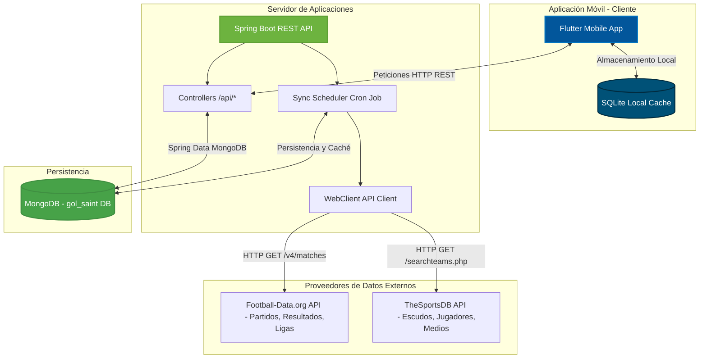

# GOL SAINT ⚽🏆

**GOL SAINT** es una plataforma profesional de análisis de fútbol, predicciones y combinaciones de apuestas deportivas de alto rendimiento.

---

## 🏛️ Arquitectura del Sistema

La aplicación está diseñada bajo una arquitectura desacoplada de n-capas para optimizar velocidad, consumo de recursos y costos de API:



### Flujo de Sincronización y Caché (Evita límites de APIs externas)
1. Un **Cron Job (SyncService)** en Spring Boot se despierta cada 6 horas.
2. Consulta nuevos partidos y ligas a través de **Football-Data.org**.
3. Consulta detalles multimedia (escudos y jugadores) usando **TheSportsDB**.
4. Realiza la combinación de datos (Merge) en memoria y los persiste en la base de datos **MongoDB (`gol_saint`)**.
5. La app de **Flutter** consume directamente los endpoints del backend en milisegundos, sin golpear las APIs externas.

---

## 📂 Estructura del Proyecto

```text
ApuestasFutbol/ (GOL SAINT Workspace)
├── README.md (Este archivo)
├── backend/ (Servicios e Integración REST)
│   ├── pom.xml
│   ├── README.md (Documentación técnica del backend)
│   └── src/
│       └── main/
│           ├── java/com/golsaint/
│           │   ├── GolSaintApplication.java (Punto de entrada)
│           │   ├── controller/ (API Controllers)
│           │   ├── model/ (Documentos de MongoDB)
│           │   ├── repository/ (Interfaces Spring Data MongoDB)
│           │   └── service/ (Consumo de APIs y Scheduler)
│           └── resources/
│               ├── application.yml (Credenciales y propiedades)
│               └── DB Gol Saint.json (Estructura de la Base de Datos MongoDB)
└── lib/ (Código fuente de Flutter Mobile App)
    ├── main.dart
    └── ... (Componentes UI y Providers de Flutter)
```

---

## 🗄️ Estructura de Documentos y Colecciones en MongoDB

La estructura de base de datos no relacional optimizada está descrita en [DB Gol Saint.json](file:///c:/Andres/proyectos%20sofware/ApuestasFutbol/backend/src/main/resources/DB%20Gol%20Saint.json) y consta de las siguientes colecciones:

* **`paises`**: Ubicación y banderas oficiales de las competiciones y clubes.
* **`ligas`**: Ligas oficiales en las que participan los equipos.
* **`competiciones`**: Copas, ligas o torneos internacionales sincronizados.
* **`equipos`**: Clubes de fútbol con sus estadísticas, escudo e ID de proveedor externo.
* **`jugadores`** y **`jugador_ratings`**: Perfil de futbolistas con histórico temporal de habilidades (velocidad, pase, tiro, etc.).
* **`partidos`** y **`estadisticas_partido`**: Registro de enfrentamientos y métricas de juego (posesión, tiros, córners).
* **`cuotas`**: Histórico de cuotas en tiempo real por partido y casa de apuestas.
* **`combinaciones`** y **`combinacion_detalle`**: Algoritmo generador de apuestas múltiples con simulación de inversión y ganancias.
