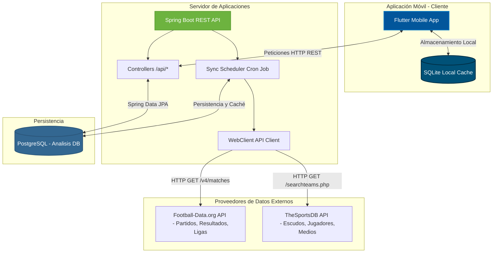

# GOL SAINT ⚽🏆

**GOL SAINT** es una plataforma profesional de análisis de fútbol, predicciones y combinaciones de apuestas deportivas de alto rendimiento.

---

## 🏛️ Arquitectura del Sistema

La aplicación está diseñada bajo una arquitectura desacoplada de n-capas para optimizar velocidad, consumo de recursos y costos de API:



### Flujo de Sincronización y Caché (Evita límites de APIs externas)
1. Un **Cron Job (SyncService)** en Spring Boot se despierta cada 6 horas.
2. Consulta nuevos partidos y ligas a través de **Football-Data.org**.
3. Consulta detalles multimedia (escudos y jugadores) usando **TheSportsDB**.
4. Realiza la combinación de datos (Merge) en memoria y los persiste en la base de datos **PostgreSQL (`Analisis`)**.
5. La app de **Flutter** consume directamente los endpoints del backend en milisegundos, sin golpear las APIs externas.

---

## 📂 Estructura del Proyecto

```text
ApuestasFutbol/ (GOL SAINT Workspace)
├── README.md (Este archivo)
├── backend/ (Servicios e Integración REST)
│   ├── pom.xml
│   ├── README.md (Documentación técnica del backend)
│   └── src/
│       └── main/
│           ├── java/com/apuestas/futbol/
│           │   ├── FutbolApplication.java (Punto de entrada)
│           │   ├── controller/ (API Controllers)
│           │   ├── model/ (Entidades de Base de Datos JPA)
│           │   ├── repository/ (Interfaces Spring Data JPA)
│           │   └── service/ (Consumo de APIs y Scheduler)
│           └── resources/
│               ├── application.yml (Credenciales y propiedades)
│               └── schema.sql (Estructura de Base de Datos)
└── lib/ (Código fuente de Flutter Mobile App)
    ├── main.dart
    └── ... (Componentes UI y Providers de Flutter)
```

---

## 🗄️ Esquema Relacional de Base de Datos Local (PostgreSQL)

El modelo relacional optimizado en [schema.sql](file:///c:/Andres/proyectos%20sofware/ApuestasFutbol/backend/src/main/resources/schema.sql) consta de las siguientes tablas:

* **`pais`**: Ubicación y banderas oficiales de las competiciones y clubes.
* **`liga`**: Ligas oficiales en las que participan los equipos.
* **`competicion`**: Copas, ligas o torneos internacionales sincronizados.
* **`equipo`**: Clubes de fútbol con sus estadísticas, escudo e ID de proveedor externo.
* **`jugador`** y **`jugador_rating`**: Perfil de futbolistas con histórico temporal de habilidades (velocidad, pase, tiro, etc.).
* **`partido`** y **`estadistica_partido`**: Registro de enfrentamientos y métricas de juego (posesión, tiros, córners).
* **`cuota`**: Histórico de cuotas en tiempo real por partido y casa de apuestas.
* **`combinacion`** y **`combinacion_detalle`**: Algoritmo generador de apuestas múltiples con simulación de inversión y ganancias.
